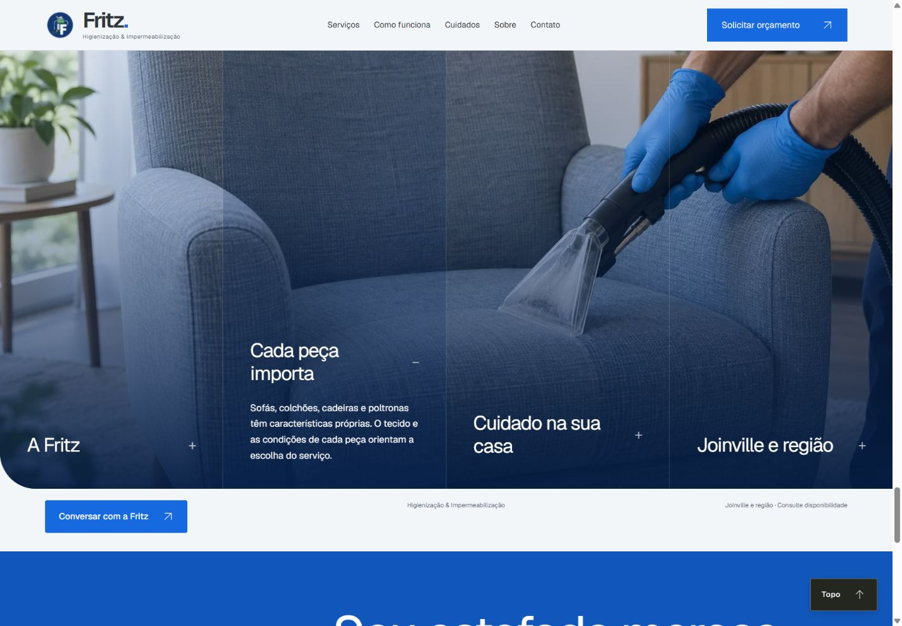
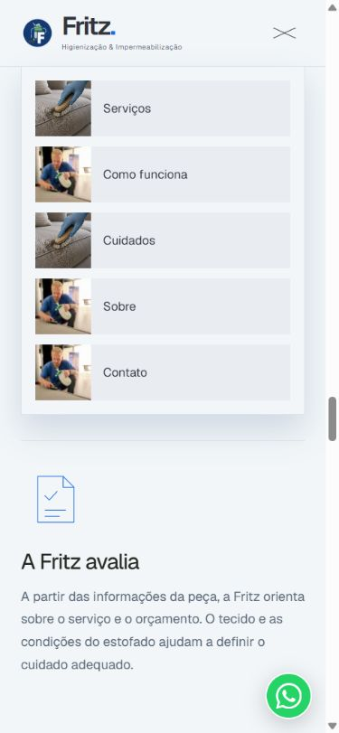
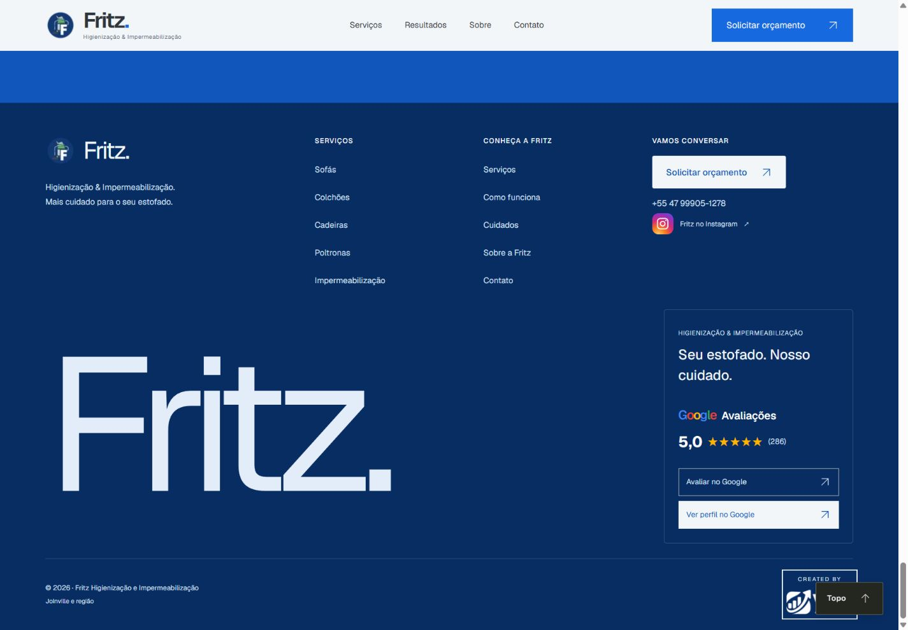

<div align="center">

# Fritz — Higienização e Impermeabilização

**Mais cuidado para o seu estofado.**

Site institucional para apresentar os serviços da Fritz em Joinville e região e facilitar a solicitação de orçamento pelo WhatsApp.

[Site público](https://higienizacaofritz.vercel.app/) · [Interface](#interface) · [Executar localmente](#executar-localmente) · [Manutenção](#manutenção)

**Next.js 16 · React 19 · TypeScript · Framer Motion · WebP responsivo**

</div>



## Sobre o projeto

A Home apresenta higienização de sofás, colchões, cadeiras e poltronas, além de impermeabilização. O conteúdo conduz o visitante dos serviços às etapas de atendimento, aos cuidados com o tecido e à apresentação da empresa.

A identidade visual combina fundo gelo, azul Fritz, tipografia Geist local e fotografia. A navegação acompanha a rolagem; os cartões e painéis interativos mantêm o conteúdo organizado em desktop, tablet e celular.

Os contatos e os dados do Google foram extraídos do material original fornecido pela Fritz. As fotos reais da empresa convivem com imagens geradas de procedimentos, identificadas na interface como ilustrativas; estas não representam atendimentos ou resultados reais.

## Interface

### Serviços e atendimento

- Cinco serviços com descrições e mensagens específicas para orçamento.
- Três etapas de atendimento: envio de fotos, avaliação e agendamento.
- Acordeão “Cada tecido pede um cuidado”, com avaliação, higienização e conservação.
- Painéis “Sobre a Fritz”, incluindo a foto real do profissional.
- Contato por WhatsApp e rodapé com Instagram e ações do Google.

### Navegação mobile

<p align="center">
  
</p>

### Rodapé e Google



> Capturas locais feitas durante o desenvolvimento. Elas registram momentos da interface; detalhes podem variar conforme novas alterações. O endereço público pode exibir uma versão anterior ao código deste repositório.

## Recursos

| Área             | Implementação                                                                                            |
| ---------------- | -------------------------------------------------------------------------------------------------------- |
| Header           | Menu com Serviços, Como funciona, Cuidados, Sobre e Contato; header horizontal após o hero.              |
| Animação         | Revelação de texto pela rolagem, sobreposição de cartões e transições dos painéis.                       |
| Imagens          | Recursos locais, otimização do Next.js e variantes WebP para os cinco serviços.                          |
| Acessibilidade   | Link de salto, foco visível, estados de expansão, painéis inativos e preferência por movimento reduzido. |
| Contato          | Links de WhatsApp com mensagem contextual e Instagram oficial.                                           |
| Google           | Links da Fritz para avaliação e perfil; nota e quantidade centralizadas na configuração.                 |
| SEO              | Metadados, imagem de compartilhamento, robots e sitemap.                                                 |
| Medição opcional | GA4, Google Ads e Meta Pixel condicionados à configuração e ao consentimento.                            |

### Imagens responsivas

Os arquivos ficam em `src/assets/images` e são importados como módulos. O componente `ResponsiveImage` seleciona a variante pelo breakpoint:

| Largura             | Variante |
| ------------------- | -------- |
| Abaixo de 768 px    | Mobile   |
| De 768 a 1023 px    | Tablet   |
| A partir de 1024 px | Desktop  |

Os cinco serviços têm 15 arquivos WebP em `src/assets/images/pages/home/fritz/servicos`: três versões por serviço. As imagens grandes usam um canto arredondado em desktop e tablet, preservando o recorte reto no celular. As capturas de `docs/readme` são documentação e não entram na interface.

## Executar localmente

Use **Node.js 22.22.2** e **npm 11.15.0**. O intervalo de Node aceito é `>=22.22.2 <23`.

```bash
git clone https://github.com/agencyvbg/fritz-higienizacao.git
cd fritz-higienizacao
npm ci
```

Copie a configuração de referência:

```powershell
# Windows / PowerShell
Copy-Item .env.example .env.local
```

```bash
# macOS / Linux
cp .env.example .env.local
```

```bash
npm run dev
```

Abra [localhost:3000](http://localhost:3000). Para usar a porta da revisão local:

```bash
npm run dev -- --port 3003
```

### Produção

```bash
npm run build
npm start
```

## Configuração

A referência está em [.env.example](.env.example). A indexação e a medição ficam desativadas por padrão.

| Variável                               | Finalidade                                                            |
| -------------------------------------- | --------------------------------------------------------------------- |
| `SITE_URL`                             | Origem HTTPS pública. Padrão: `https://higienizacaofritz.vercel.app`. |
| `SITE_INDEXABLE`                       | Habilita indexação quando definido como `true`.                       |
| `GOOGLE_SITE_VERIFICATION`             | Verificação de domínio no Google.                                     |
| `META_DOMAIN_VERIFICATION`             | Verificação de domínio na Meta.                                       |
| `NEXT_PUBLIC_TRACKING_ENABLED`         | Ativa a integração de medição com IDs configurados.                   |
| `NEXT_PUBLIC_GA4_ID`                   | Propriedade GA4.                                                      |
| `NEXT_PUBLIC_GOOGLE_ADS_ID`            | Tag do Google Ads.                                                    |
| `NEXT_PUBLIC_GOOGLE_ADS_CONTACT_LABEL` | Conversão de clique de contato.                                       |
| `NEXT_PUBLIC_META_PIXEL_ID`            | Pixel da Meta.                                                        |
| `NEXT_PUBLIC_PRIVACY_URL`              | Política de privacidade HTTPS, obrigatória com medição ativa.         |

Alterações de variáveis exigem novo build. Os SDKs de medição são carregados após consentimento da categoria correspondente. Um clique no WhatsApp indica intenção de contato, não comprova mensagem enviada ou venda. Consulte [SEO e mensuração](docs/seo-e-mensuracao.md).

## Manutenção

| O que editar                     | Arquivo ou diretório                           |
| -------------------------------- | ---------------------------------------------- |
| Nome, domínio e indexação        | `src/config/site.ts`                           |
| WhatsApp e Instagram             | `src/config/contact.ts`                        |
| Perfil Google, nota e avaliações | `src/config/google-business.ts`                |
| Menus e links internos           | `src/config/navigation.ts`                     |
| Metadados e compartilhamento     | `src/config/metadata.ts`                       |
| Textos                           | Arquivos `*.content.ts` em `src/sections/home` |
| Imagens                          | `src/assets/images` e arquivos `*.images.ts`   |
| Cores                            | `src/styles/tokens.css`                        |

A nota **5,0** e as **286 avaliações** são o registro do material fornecido, sem atualização automática. Revise esses valores no Google antes de alterá-los.

### Organização

```text
src/
├── app/                 # Home, layout, ícones e metadados
├── assets/              # Imagens e fontes locais
├── components/          # Layout, UI, mídia e consentimento
├── config/              # Site, contatos, navegação e Google
├── lib/                 # Utilitários compartilhados
├── sections/home/
│   ├── hero/            # Apresentação inicial
│   ├── environments/    # Mensagem e cartões de serviços
│   ├── services/        # Como funciona o atendimento
│   ├── process/         # Cuidados com o tecido
│   ├── studio/          # Sobre a Fritz
│   └── contact/         # Orçamento pelo WhatsApp
└── styles/              # Tokens, fontes e estilos globais
```

Os nomes internos `environments`, `services` e `studio` foram preservados da estrutura original; a tabela acima descreve sua função atual. As convenções estão em [arquitetura](docs/arquitetura.md) e [modelo de seção](docs/secao-modelo.md).

## Verificações

```bash
npm run check
npm run test:tracking
npm run build
npm run audit
```

`check` executa lint, TypeScript e verificação de formatação. O build e as verificações de código passaram durante a adaptação. A interface foi inspecionada no navegador em desktop e celular; esses testes não constituem certificação WCAG ou medição Lighthouse.

## Publicação

1. Importe o repositório `agencyvbg/fritz-higienizacao` na Vercel com o preset Next.js.
2. Configure as variáveis para o ambiente de destino.
3. Confirme `SITE_URL` ao usar domínio próprio.
4. Habilite indexação após a revisão final do conteúdo público.
5. Confira navegação, imagens, compartilhamento e destinos de contato no deploy.

## Documentação

- [Direção visual e decisões da Fritz](docs/design-brief-fritz.md)
- [Arquitetura](docs/arquitetura.md)
- [Convenções de seção](docs/secao-modelo.md)
- [Dependências](docs/dependencias.md)
- [SEO e mensuração](docs/seo-e-mensuracao.md)

Para a direção visual atual, consulte o brief da Fritz.

## Desenvolvimento

Desenvolvido por **[VBG Agency](https://www.instagram.com/vbgagency/)** para **Fritz Higienização e Impermeabilização**.

A licença da fonte Geist está em [src/assets/fonts/geist/LICENSE](src/assets/fonts/geist/LICENSE). O repositório não declara uma licença geral de distribuição; a reutilização deve respeitar a autorização dos responsáveis e as licenças dos recursos.
